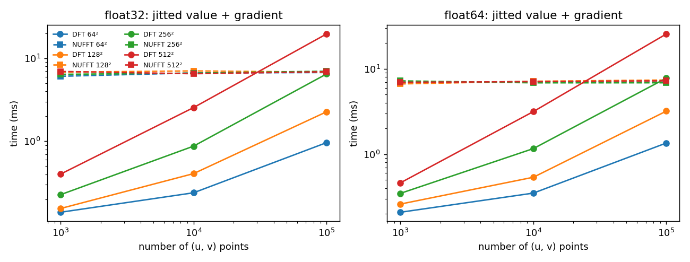
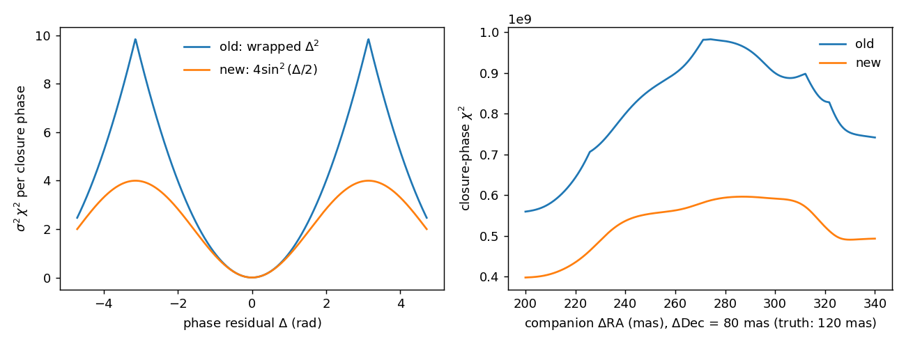
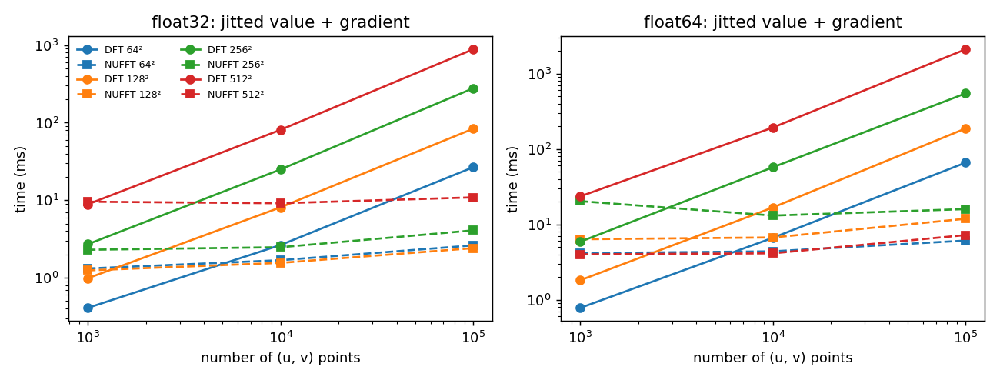

# Design note: image reconstruction

Status: **planned.** Stage 0 (this note and the likelihood unification) is
under way. The staged plan is in `design/imaging_plan.md`; this note records
the decisions and the evidence behind them, and is updated at the end of every
stage.

## Purpose and scope

We are adding regularised maximum-a-posteriori (MAP) image reconstruction to
virgil, with optional Bayesian sampling of the same objective. The image
is one more `Component` in a `System`: analytic pieces (stars, companions)
stay analytic, and only resolved emission goes into pixels. The target data
are AMIGO DISCO products from JWST AMI, closure phases from long-baseline
interferometers (VLTI, CHARA), and aperture-masking data. The priorities are
robustness, little technical debt, and code that a new PhD student or a
sceptical astronomer can read.

## Decisions

### 1. Numerical precision

Every Fourier transform and matmul uses `precision=lax.Precision.HIGHEST`.
Fitting entry points (`fit`) default to
`dtype="float64"` and run inside a local `jax.enable_x64(True)` context,
casting their inputs; `dtype="float32"` is opt-in. Forward-model code is
dtype-agnostic and must pass the float32 test suite. x64 is never enabled
globally.

Why:
- On A100/H100 GPUs JAX's default matmul precision is TF32 (errors of about
  1e-3), which is useless for closure phases. `HIGHEST` defeats it.
- Float32 log-densities of 10^4 to 10^5 carry about 0.1 absolute error, so
  samplers should run in float64.
- Enabling x64 globally would change the behaviour of user code and is
  forbidden in tests by `AGENTS.md`.

### 2. One likelihood

`whitened_residuals(model, data)` returns (model - data)/sigma for amplitudes
and visibilities, and Delta/sigma for projected (kernel or DISCO) phases. For
unprojected closure phases it returns **2 sin(Delta/2)/sigma**.
`model_loglike` is redefined on top of it, so grids, limits, `numpyro_model`
and fitting share one definition.

Why:
- r^2 = 2(1 - cos Delta)/sigma^2 is exactly a von Mises likelihood with
  kappa = 1/sigma^2. It equals the Gaussian for small Delta and is smooth at
  +/- pi, where the present wrapped residual has a kink.
- Projected phases cannot be wrapped this way (the projection is linear in the
  unwrapped phase), so they use Delta/sigma. This is a known hazard: they jump
  if a model visibility crosses the negative real axis. Binaries with flux < 1
  never do, but images and uniform disks beyond their first null can. The
  `diagnose` regime check (Stage 3) flags |arg V| > 0.8 pi or |V| < 0.05.
- Least-squares optimisers need residuals, not a scalar log-likelihood, and
  having a second definition would be a source of drift.

### 3. One specification for fitting and sampling

`fit(model, priors, data, regularisers)` and `numpyro_model(model, priors,
data, regularisers)` take the same arguments. The free parameters are exactly
the keys of `priors`, a dict of NumPyro distributions (NumPyro is used only as
a distributions library), and support-respecting transforms come from
`biject_to`. `fit` finds the MAP; `numpyro_model` is the posterior for
samplers and refuses non-probabilistic regularisers (MEM, TV, TSV).

Why:
- One parameter currency for fitting and sampling avoids a bespoke transform
  library and a sampler wrapper.
- Reusing `numpyro_model`'s conventions avoids a second fitting API (an
  earlier `Problem` class did that and was removed).
- Refusing to build a posterior from a penalty that is not a prior stops users
  quoting credible intervals for something that is not one.

### 4. Optimisers

`fit(problem, method=...)` with:
- `"lm"`: optimistix Levenberg-Marquardt, with a matrix-free, fixed-length
  `lx.Normal(lx.CG)` or `lx.LSMR` inner solve. It never forms a Jacobian and is
  the default when residuals exist.
- `"lbfgs"`: optimistix LBFGS, for MEM, TV and free error inflation.
- `"adam"`: optax, now a declared runtime dependency.

Why:
- In the toy test (below), LM reached a loss of 2750 in about 1 s where
  L-BFGS and Adam were 1 to 2 orders of magnitude worse after hundreds of
  iterations.
- The default `lx.QR()` solver and `jac="bwd"` materialise the Jacobian; the
  matrix-free variant with `jac="fwd"` does not.
- An inner solve with non-zero tolerances that hits `max_steps` aborts the
  outer solve, so the inner iteration count is fixed. Plain `GaussNewton` has
  no globalisation.
- With whitened GP latents the prior Hessian is the identity, so the LM system
  is exactly the MGVI metric J^T N^-1 J + 1.
- Adam is invariant to diagonal gradient scaling, so Fisher preconditioning
  only matters for SGD.

### 5. Image parameterisation

`Image(log_brightness, pixel_scale_mas, support=None, flux, dra, ddec,
rotation_deg=0)` is a `Component`, with `brightness = softmax(eta,
where=support)`. `log_brightness` is either a plain array (free log-pixels,
MAP only) or an object with `evaluate(pixel_scale_mas=...)`, such as
`GaussianField` (Stage 5). That is the zodiax 0.6 `Expression` protocol, so
moving to zodiax 0.6 later is an import change. zodiax stays at `>=0.4`.

Why:
- The softmax enforces positivity and unit total flux in one step; the
  component `flux` carries the scale.
- A `Component` gets offsets and `System` mixing for free
  (V = sum f_i(lambda) V_i / sum f_i(lambda)), so SPARCO-style scenes
  (Kluska et al. 2014) need no new mixing code.
- Note for the migration: `HarmonixModel.source` is a static field that may
  hold arrays, which zodiax 0.6's new check would reject.
- The GP field uses a DCT with a Matern-like spectrum
  S ~ (kappa^2 + lambda_jk)^(-order), S_00 = 0, normalised to mean variance
  sigma^2. `order=1` is exactly TSV plus L2 on log-brightness (the GMRF of
  Tiede et al., arXiv:2511.17706).

### 6. Fourier backends

Visibilities are the exact separable DFT, or the exact two-sided MFT for
data on uv lattices (Stage 2b). A NUFFT backend (jax-finufft) was built and
benchmarked in Stage 2 and then **removed** (issue #75): accurate, but on a
GPU its per-call planning cost (jax-finufft #157) made it slower than the
DFT except for very large problems. Revisit only when jax-finufft can reuse
plans; its code is in the git history of PR #71. A padded FFT with
interpolation is never used.

Why:
- The DFT is exact to float32 rounding (accuracy table below) and cheap for
  the small uv sets typical here (AMI has 47 points).
- A padded FFT needs x8 padding and cubic interpolation to reach 1e-5 rad on
  weak baselines, and that was measured in float64. Martinache (2018) found
  nearest-pixel FFT sampling about 50 times worse than his direct DFT.
- FINUFFT has a per-point bound |dV_j| <= eps ||I||_1 and a float32 floor of
  about 1e-5 to 3e-5. That suffices for VLTI closure phases (0.2 to 1 degree)
  and for measured AMI performance (0.14 degrees), but **not** for AMI at
  1e-4 contrast (sigma_CP of about 2e-5 rad). There, use the DFT or float64
  NUFFT.
- jax-finufft re-plans on every call (issue #157) and uses private JAX
  internals (fine on 0.9.1, vmap broke on 0.10.2).
- Even N is a trap for any FFT-based method: putting the image centre at
  (N-1)/2 inside a grid centred on N/2 gives a half-pixel offset.

### 7. Rules for users

Unresolved things are analytic; resolved emission goes in pixels. Something
must fix the origin: an analytic star, a `Centroid` prior, or a centred GP
mean. Initialise from a parametric fit (`Image.from_model`).

Why:
- Closure-type observables are invariant to translation of the image (next
  section), so an unanchored fit is degenerate by construction.
- `jnp.angle` has NaN or meaningless gradients at V close to 0, and a flat
  start image failed in the toy test.
- Never jointly MAP the image and its GP hyperparameters: the posterior mode
  degenerates. Sample them, or fix them.

### 8. Dependencies

`optax` (and `lineax`) become required dependencies; `blackjax`
(`[sampling]`) will be an optional extra. We do not wrap BlackJAX;
tutorials sample `numpyro_model` with NumPyro's NUTS, or BlackJAX on the
potential from `numpyro.infer.util.initialize_model`.

Why:
- BlackJAX 1.6.2 is Apache-2.0, needs `jax>=0.9`, and all its dependencies are
  already installed. Its API moves quickly, so a wrapper would rot. It has no
  automatic constraints, which the `biject_to` transforms cover.
- optax is already present transitively and is needed for Adam.
- We do not depend on `nifty.re` (decision in the IFT section below).

## Evidence

All measurements: Apple arm64 laptop, CPU, jax 0.9.1.

### DFT timing

Jitted value and gradient of the separable DFT
`einsum('kr,rc,kc->k', B, I, A)`, in milliseconds:

| npix \ points | 10^3 | 10^4 | 10^5 |
|---|---|---|---|
| 64 | 0.36 | 2.3 | 23 |
| 128 | 0.90 | 7.7 | 75 |
| 256 | 2.5 | 23 | 226 |
| 512 | 8.1 | 78 | 817 |

### Accuracy

A 129 x 129 resolved scene (a star plus six Gaussian blobs), 2 x 10^4 random
frequencies with |f s| < 0.4, against a float64 DFT. The lowest 10% of |V|
are about 0.009.

| Method | Max \|dV\| | Max phase error, low-\|V\| points |
|---|---|---|
| float32 separable DFT | 4.7e-7 | 1.6e-5 rad |
| Padded FFT x2, bilinear | 2.6e-2 | 0.41 rad |
| Padded FFT x4, bilinear | 5.4e-3 | 0.11 rad |
| Padded FFT x4, cubic | 7.6e-6 | 2.2e-4 rad |
| Padded FFT x8, cubic | 4.4e-7 | 1.4e-5 rad |

The padded FFT ran in **float64**, which flatters it: the DFT row is float32.
These were ad hoc scripts; the Stage 2 benchmark script is in the git
history of PR #71.

### Optimiser toy test

300 x 300 pixels plus one parameter, with V^2, CP, L2 and TSV residuals:

| Optimiser | Result |
|---|---|
| LM, `Normal(CG, 20 steps)` | loss 1.8e10 to 2750 in 30 steps (about 1 s) |
| `optax.lbfgs` | about 2.9e4 after 300 iterations |
| Adam | about 7e4 |

This was a planning-agent toy, not a benchmark on real data.

## Gauge freedoms and how other codes fix them

- Closure, kernel and DISCO phases are invariant to image translation. V^2
  alone also leaves a 180 degree flip ambiguity. Normalised visibilities
  remove the flux scale.
- The gradient of an invariant objective has no component along the gauge
  direction. Drift (MiRA's "travelling modes") comes from whatever breaks the
  symmetry: edges, positivity, and the pixel washboard.

| Fix | Codes |
|---|---|
| Centred default image | BSMEM, eht-imaging |
| Centroid penalty | eht-imaging `cm`, SMILI, SQUEEZE, OITOOLS `centering`, DPI |
| Compactness | MiRA, WISARD |
| Hard reparameterisation | Comrade `shifted(m, -centroid)`; SPARCO (star at the origin) |
| Integer recentring between runs | MiRA `-recenter` |

Our rule: an analytic star, a `Centroid` prior (a Gaussian on the centroid,
which is legitimately probabilistic), or a centred GP mean. Key reference:
Thiebaut & Young 2017 (arXiv:1708.08390).

## What we take, and what we don't

### dorito (Charles et al., arXiv:2510.10924)

Take only the pure pieces:
- the regularisers in `stats.py` (TV = sum sqrt(dx^2 + dy^2 + eps^2),
  TSV = sum(dx^2 + dy^2), ME = sum P log P, L1, L2, with zero-padded
  differences) and the weighted-sum `reg_dict`;
- the linear basis idea (`LinearBasis`, and `LatentBasis` from PR #32);
- the phase-centre (centroid) prior.

Do not take:
- the forward model (an MFT onto the gridded 51 x 51 AMI half-plane,
  downsampled by 2, divided by `base_uv`), the parallactic-angle rotation with
  linear interpolation, or the amigo coupling;
- PR #32 (`frito_overhaul`) as it stands: it is an open draft with bugs
  (`eqx` used without import, a `contrast` keyword mismatch, an inconsistent
  `log_dist`).

`amigo.py` already reads PR #32's mixed-DISCO format. dorito's WR 137 recipe
(`ME` weight 1e5, Adam 1e-3 for 20k epochs then BFGS, a phase-centre prior of
width 1e-3 and a sum-to-one prior) is what the Stage 3 simulated example
imitates.

### IFT and NIFTy

Mostly Gaussian-process and hierarchical-Bayes machinery under other names
(Ensslin et al. 2009; Arras et al. 2021; Edenhofer et al. 2024).

Take:
- whitened latents (N(0,1) parameters mapped to the field);
- the DCT Matern-like field of decision 5.

Do not take a dependency on `nifty.re`: its licence metadata is ambiguous, it
changes between versions, its demos assume x64, `amend` makes callables
static, and J-UBIK forces x64 globally. MGVI and geoVI are not planned; the
LM metric with whitened latents gives the same linear algebra.

## Deferred items

| Item | Revisit when |
|---|---|
| Forward-model centroid recentring | Sampling drifts in position despite the centroid prior |
| Twin-folding helpers | We fit V^2-only data routinely |
| Basis and decoder parameterisations | zodiax 0.6 `Map`/`Mask`/decoders are released |
| MGVI/geoVI | Not planned |
| Bandwidth-smearing forward model | A real field-of-view need |
| Reinstating a NUFFT backend (issue #75; code in PR #71) | jax-finufft reuses plans (jax-finufft #157) and we have datasets of ≳10⁵ irregular points with ≳256² images |

The OzSTAR GPU benchmark was run on 2026-09-30; see "GPU benchmark results"
below. Any re-run is done by the user, never by Claude.

## GPU benchmark results

The NUFFT backend was removed after Stage 3 (issue #75); its code, tests and benchmark scripts are in the git history of PR #71.

Run 2026-09-30 on OzSTAR (NT) node gina10, one NVIDIA A100-SXM4-80GB,
jax 0.10.2 with the conda-forge CUDA build of jax-finufft, by
`scripts/bench_ft_ozstar.sbatch` (job 17776437). Raw results in
`figures/bench_ft_gpu.json`, log in `figures/bench_ft_gpu.log`. The job
set `JAX_DEFAULT_MATMUL_PRECISION=default`, so JAX used TF32 unless the
code asked otherwise.

**Precision** (256² image, 10⁴ points; max |ΔV| against a float64 CPU DFT,
V(0) = 1):

| Transform | Max \|ΔV\| |
| --- | --- |
| DFT, float32, `Precision.HIGHEST` (virgil) | 7.9e-7 |
| DFT, float32, JAX default (TF32) | 2.7e-5 |
| NUFFT, float32 (eps 1e-5) | 2.9e-6 |
| NUFFT, float64 (eps 1e-7) | 2.8e-8 |

- `HIGHEST` does its job: the float32 DFT on the A100 is as accurate as on
  a CPU, and 34× better than the TF32 default. The TF32 error is smaller
  than the ~1e-3 per-element figure because errors average over pixels,
  but at 2.7e-5 it is already at AMI's closure-phase requirement (σ ~ 2e-5
  rad), so the rule stands.
- FINUFFT's float64 GPU accuracy is fine here (2.8e-8), so the concern
  from jax-finufft issue #162 does not apply to this build.

**Speed** (jitted value + gradient, ms):

| float32, ms | 10³ pts | 10⁴ | 10⁵ |
| --- | --- | --- | --- |
| DFT 64² / NUFFT 64² | 0.14 / 6.1 | 0.24 / 6.7 | 0.96 / 6.8 |
| DFT 128² / NUFFT 128² | 0.15 / 6.8 | 0.41 / 7.1 | 2.3 / 6.8 |
| DFT 256² / NUFFT 256² | 0.23 / 6.4 | 0.87 / 6.7 | 6.5 / 7.0 |
| DFT 512² / NUFFT 512² | 0.40 / 7.0 | 2.6 / 6.5 | 20 / 6.9 |

- The NUFFT costs a flat ~7 ms per call, whatever the size: jax-finufft
  re-plans on every call (its issue #157), and that dominates.
- The DFT is therefore faster on the GPU everywhere except the largest
  case, 512² with 10⁵ points (20 against 7 ms; 26 against 7 in float64).
  They break even at npix² × points ≈ 7 × 10⁹ (256² × 10⁵).
- The GPU DFT is 45× faster than the laptop CPU at 512² × 10⁵ in float32
  (20 against 886 ms).

**Rule of thumb, updated:** use the DFT (or the MFT for lattices) by
default on both CPU and GPU. Use the NUFFT on a CPU above ~10³ irregular
points (npix² × points ≳ 3 × 10⁷), and on a GPU only for very large
problems (npix² × points ≳ 10¹⁰) until jax-finufft can reuse its plans.

## Stage log

### Stage 0

Every likelihood now goes through `likelihood.whitened_residuals`:
`model_loglike`, `loglike_nosignal` and the Absil limits' χ². Unprojected
phase residuals are the chord 2 sin(Δ/2)/σ; everything else is Δ/σ.
`OIData.residuals` still wraps phases, and is kept for display.

*Left:* the per-point term. *Right:* the closure-phase χ² along a slice
through a region where residuals wrap (bright companion, ν Hor AMI
coverage). The old wrapped Δ² has kinks wherever a residual crosses ±π; the
chord is smooth. Made by `figures/phase_wrap_chi2.py`.

Regression, on the in-repo simulated ν Hor binary (41 × 41 × 30 grid):

| Output | Change |
| --- | --- |
| `likelihood_grid` within 50 of the peak | ≤ 0.005 in log L; same best point |
| `optimized_likelihood_grid` | ≤ 0.03 in log L (relative 1e-4) |
| `absil_limits` (3σ) | relative ≤ 6e-5 |

Only badly fitting grid points change much (up to 7% of log L), because
the chord is shorter than the arc for large Δ. One side benefit: the old
wrap, mod(Δ + π, 2π) − π, loses float32 precision (the spacing of float32
numbers near π is 2.4e-7), which is a relative error of 4e-4 on a
6e-4 rad residual. The chord has no such loss.

Moved to the stage that first uses them, to avoid unused code: the
`_precision` helper (Stage 3, with `fit`) and the synthetic-coverage
generator and ν Hor MATISSE fixture (Stage 4).

### Stage 1

### Stage 2

The NUFFT backend was removed after Stage 3 (issue #75); its code, tests and benchmark scripts are in the git history of PR #71.

`Image(..., backend="nufft")` and `image_visibilities(..., backend=)` use
jax-finufft's type-2 transform, `nufft2(I, t_row, t_col, iflag=+1)` with
t = 2π·s·f (s the pixel scale, f = u/λ in cycles per mas), times
exp(+i t/2) along each even-length axis. That is because the pixel centre
is at (n − 1)/2 but FINUFFT's mode 0 is at n/2. `eps` is fixed by dtype:
1e-7 in float64 and 1e-5 in float32 (FINUFFT cannot go much below 1e-6 in
single precision). No user-facing `eps` knob until someone needs one. The
optional extra was `nufft` (there is no such extra now that the backend is removed), tested in its own CI job.

Laptop CPU (Apple arm64, jax 0.9.1, jax-finufft 1.3.1 pip wheel), jitted
value + gradient of Σ|V|², from `scripts/bench_ft.py`; raw numbers in
`figures/bench_ft_cpu.json`. Another agent was running at the same time,
so treat single points (e.g. float64 NUFFT at 256²) as noisy.

| float32, ms | 10³ pts | 10⁴ | 10⁵ |
| --- | --- | --- | --- |
| DFT 64² / NUFFT 64² | 0.41 / 1.3 | 2.6 / 1.7 | 27 / 2.6 |
| DFT 128² / NUFFT 128² | 0.98 / 1.2 | 8.1 / 1.6 | 84 / 2.4 |
| DFT 256² / NUFFT 256² | 2.7 / 2.3 | 25 / 2.5 | 278 / 4.1 |
| DFT 512² / NUFFT 512² | 8.8 / 9.6 | 81 / 9.1 | 886 / 11 |

The NUFFT's largest error against the DFT is 7e-6 in float32 and 3e-8 in
float64, with V(0) = 1, inside the 3·eps bound that `tests/test_nufft.py`
enforces.

**Rule of thumb (CPU):** keep the default DFT below ~10³ points or when
npix² × points ≲ 3 × 10⁷ (AMI, with 47 points per filter, is always DFT). Use
the NUFFT above that: at 10⁵ points it is 10–80× faster in float32 and
10–300× in float64. In float32, the DFT is also the more accurate
(~5e-7 against 1e-5), which matters for AMI-level closure phases (σ ~ 2e-5
rad). On a GPU the crossover is much later; see "GPU benchmark results".

### Stage 2b: uv lattices and the matrix Fourier transform

AMI DISCO data are sampled on the detector's Fourier grid. For the real
ν Hor product (F430M), the 1860 uv samples lie exactly on a 61 × 31
half-plane lattice with a 0.2165 m pitch, rotated on the sky by −6.894°
(the parallactic angle 353.106°). The two-sided MFT (Soummer et al. 2007),
V = A_v · I · A_uᵀ, is exact there, and costs N_v·N² + N_u·N_v·N rather
than M·N². It separates only when the image's pixel lattice A and the uv
lattice B have BᵀA diagonal. Rotating both by the same angle keeps that,
but sky-aligned pixels with a rotated uv lattice do not.

- `_geometry.find_uv_grid(u, v)` finds the lattice when data are loaded
  (to 1e-6 of a cell; otherwise `None`), and `OIData.uv_grid` stores it as
  a `UVGrid` (axes, sample index, rotation). The AMIGO loader fills it in,
  so data files need no new fields.
- `SourceModel.model_on_grid(u, v, wavel, grid)` defaults to `model`, so
  every analytic model is unchanged. `System` passes it to its parts, and
  `Image` overrides it with the MFT (`_geometry.grid_visibilities`) when
  its `rotation_deg` matches the grid's, its backend is the DFT and there
  is one wavelength. Otherwise it falls back to the exact per-point sum.
- `Image(rotation_deg=θ)` puts the pixel lattice at position angle θ;
  `render`, `plot_model` and `from_model` resample to and from North-up.
- The MFT is ours (it shares its matrices with the DFT, at
  `Precision.HIGHEST`) rather than `dLux.utils.MFT`, whose matmuls use
  JAX's default precision (TF32 on A100/H100) and which would move zodiax
  to 0.5. A one-off check against `dlu.MFT` 0.15.1 agreed to 1e-15
  (float64, odd and even N) after flipping both image axes (dLux counts x
  and y up with the column and row index) and a constant normalisation.
- On the real ν Hor F430M coverage (1860 samples, 833 modes), jitted
  value + gradient of `model_loglike` for a star + image `System`: 0.31
  against 0.85 ms at 64², 0.51 against 1.96 ms at 128², and 0.62 against
  5.16 ms at 256² (MFT against per point; laptop CPU). The DISCO
  projection (833 × 1860) is then a large share of the cost.
- `amigo.simulated_disco_record` (replaced in Stage 3 by
  `coverage.ami_grid_record`) built a small AMI-like record: a
  rotated half-plane lattice out to 6.5 m, log-amplitude modes and
  shift-invariant phase modes, diagonal errors (default 1e-4, like ν Hor),
  and no covariance matrix. DISCO errors are independent by construction,
  so `disco_covariance` is now optional in AMIGO records (still checked
  when present). The tutorial uses this record instead of the in-repo
  stand-in (`drpangloss-synthetic-mixed-disco-v1`, whose 47 uv points lie
  on one line and whose σ are ~3e-11).

### Stage 3

`fitting.fit(model, priors, data, regularisers)`, with
`_precision` (local x64 and dtype casting), and in `imaging` the
regularisers `TSV`, `TV`, `MaxEntropy` and `Centroid`, `image_priors`,
`nyquist_pixel_scale`, `l_curve` (with `corner` and `discrepancy`) and
`diagnose`.

**API.** `fit(model, priors, data, regularisers)` takes the same arguments
as `numpyro_model`, which gains `regularisers=` for genuine priors (e.g.
`Centroid`); an earlier `Problem` class duplicated that existing path and
was removed. The objective is a private helper.

**Optimisers and stopping.** Both LM and L-BFGS stop when no gradient
component of the loss per data point exceeds `gtol = 1e-4`, nor 1/1000 of
its starting value:

- A test on the parameter step never passes for image fits: the
  log-brightness of a pixel that should be dark drifts towards −∞ without
  changing the image.
- A test on the change of the loss (or residuals) passes at once from a warm
  start; along an L-curve this froze the weak-regularisation end (fits of
  1–4 steps with identical images), which made the corner and the
  discrepancy weights meaningless. The relative condition keeps warm starts
  going; warm and cold fits then agree down to w ≈ 10 (MEM).
- LM is optimistix's, with a subclass replacing its `terminate`; L-BFGS is
  optax's (zoom line search). Regulariser weights are arrays, so a sweep
  does not recompile for every weight.
- `fit` runs in float64 and casts its results back to the ambient precision.

**Simulated data.** `amigo.simulated_disco_record` (now `coverage.ami_grid_record`) filled a whole uv disc
with independent log-amplitude and phase modes, a far easier inversion than
real AMI (which made early reconstructions look much too good). It is
replaced by `coverage.ami_grid_record`: a uv grid whose information is
weighted by the mask's transfer function, with flux and position projected
out and an SVD basis kept to 99% of the precision, after AMIGO's latent
visibility basis (Desdoigts et al., PASA 43, e075 (2026), arXiv:2510.09806); and
`coverage.nrm_oidata`, classical V² and closure phases at the splodge
centres. The real ν Hor F430M product, by comparison, has 833 modes on a
1860-cell grid whose operators are confined to the splodges.

**Choosing the weight** (research in `regulariser_weight_selection.md`):
`l_curve` fits from strong to weak regularisation with warm starts;
`corner()` is Hansen's maximum curvature of (log χ², log R) against log w;
`discrepancy(target=1)` is Morozov's principle, with the binding (worst)
dataset deciding. The truth itself has χ²/N = 1.01 on these data; a target
of 1 + 2√(2/N), tried first, over-regularised (images with NCC 0.57–0.69
against 0.71–0.79 at the best weights). Cross-validation, GCV/SURE and the
evidence are deferred to Stage 5.

**Display.** Reconstructions are shown with the beam (`imaging.beam`: the
FWHM of a Gaussian matched to the curvature of the dirty beam's core, from
the uniformly weighted second moments of the informative uv samples) in the
lower left, next to signed residual maps (`plotting.plot_residual_map`;
z-scores when there are uncertainties), in a field of
`imaging.field_of_view` (500 mas, or λ/B_min if smaller).

**Recovery on simulated AMI-like data** (`notebooks/mwe/mwe_recovery_sweep`:
62² × 20 mas pixels (a 1240 mas field, about 8 beams), scenes three to
four beams across, a star plus extended emission with a fraction f of its
flux, `ami_grid_record` at 4.8 µm with σ = 1e-4 where the transfer is one,
maximum entropy at the discrepancy weight; normalised cross-correlation
with the truth; beam about 154 × 131 mas):

| f | spiral | ring | core + clump |
| --- | --- | --- | --- |
| 10% | 0.963 | 0.996 | 0.991 |
| 3% | 0.914 | 0.985 | 0.980 |
| 1% | 0.746 | 0.938 | 0.937 |

An earlier version with scenes about one beam across (a 500 mas field)
recovered them badly (NCC 0.62–0.89): with only a few resolution elements
across the object, the regulariser fills in most of the structure. On the
ring, at their discrepancy weights, MEM did best (NCC 0.983), then TSV
(0.967) and TV (0.926) (`mwe_l_curve`).

### Stage 4

Long-baseline imaging needed no new fitting code: `fit` and `l_curve` already took lists of datasets.

- **Added:**
  - synthetic VLTI and NRM coverage;
  - a hole in the support under the star, and a fitted image flux, which together remove the spurious central spot and the SPARCO ratio bias;
  - `Rotated` scenes, and models per dataset in `fit` (4b);
  - `BlackBody` spectra, and the `FlaredDisk` family (from #80).
- **SPARCO check:** the environment's spectral index is only defined relative to the star's assumed spectrum. Both apparent mismatches with published PIONIER analyses came from that, not from the code.
- **Stress test:** χ² per point reached one in every case, so it says nothing about fidelity. Coverage costs more than noise.

The details are in the plan's Stage 4 log.

### Stage 5

The Gaussian-process prior, `fields.GaussianField`, implements decision 5:
- a DCT field with a Matérn-like spectrum;
- whitened latents with N(0, 1) priors, so its MAP is a Levenberg–Marquardt fit in a few dozen steps.

Its hyperparameters, and the maximum-entropy weight, can be chosen from the evidence:
- `log_evidence` and `LCurve.classic_maxent` use the Gauss–Newton curvature, computed densely, which is fine up to about 10⁴ data or pixels;
- `error_scale` re-estimates the error bars from the same curvature (MacKay's β).

On simulated VLTI and AMI data the GP image matches or beats maximum entropy. On PIONIER data it gives the cleanest images, with spectral indices bracketing the published values. Sampling works with `numpyro_model` and numpyro's NUTS, and its coverage is calibrated at 16². At about 40², sampling needs a better mass matrix. The details are in the plan's Stage 5 logs.

### Stage 6

Additions driven by VLTI/GRAVITY data on Apep, a dusty Wolf–Rayet binary (merged from the `apep-gravity` branch):
- `EllipticalGaussian` and `GaussianArc` (a Gaussian ridge along a circular arc, by quadrature), both in the render↔model test;
- an anisotropic `GaussianField` (`length_mas=(row, col)`);
- `Tabulated`, a free flux per spectral channel, provisional until 6a's `Nodes`;
- fitted error inflation, `fit(..., noise=...)` and `numpyro_model(..., noise=...)`: scales (`vis_scale`, `phi_scale`) and terms added in quadrature (`vis_error_rel`, `phi_error`), per dataset, with the likelihood's normalisation included. On Apep the calibrated errors were underestimated two- to sevenfold, and the additive terms fitted better than scales;
- `ModulatedGaussianRim` gradients made finite at zero baseline.

The lessons for spectro-interferometry and for fitting orbits with a scene are in [`spectro_interferometry_workflow.md`](spectro_interferometry_workflow.md) and [`orbit_scene_joint_fitting.md`](orbit_scene_joint_fitting.md).

### Stage 7

## References

- Thiebaut & Young 2017, arXiv:1708.08390: image reconstruction tutorial;
  gauges; quadratic regularisers as Gaussian priors.
- Chael et al. 2018, arXiv:1803.07088: closure-only imaging; the `cm`
  regulariser.
- Kluska et al. 2014, arXiv:1403.3343: SPARCO.
- Tiede et al., HIBI, arXiv:2511.17706: GMRF priors, visibility-domain
  recentring, NUTS at 64^2.
- Arras et al. 2022, arXiv:2002.05218: M87* with resolve; "source
  teleportation"; centred initialisation.
- Barnett, Magland & af Klinteberg 2019, arXiv:1808.06736: FINUFFT error
  analysis.
- Knollmuller & Ensslin, arXiv:1901.11033 (MGVI); Frank et al. 2021,
  arXiv:2105.10470 (geoVI).
- Ensslin et al. 2009, arXiv:0806.3474 (IFT); Arras et al. 2021,
  arXiv:2008.11435 (correlated field); Edenhofer et al. 2024,
  arXiv:2402.16683 (NIFTy.re).
- Ireland 2013, arXiv:1301.6205, and Martinache 2010 (kernel phase).
- Martinache, HDR thesis 2018:
  https://frantzmartinache.eu/static/share/hdr_no_papers.pdf (pp. 73 to 80).
- Sivaramakrishnan et al. 2023, arXiv:2210.17434 (AMI requirements); Sallum
  et al. 2024, arXiv:2310.11499 (AMI on-sky CP of 0.14 degrees).
- Charles et al., dorito, arXiv:2510.10924.
- Code: https://github.com/maxecharles/dorito (and PR #32), dorito_notebooks,
  https://github.com/LouisDesdoigts/amigo,
  https://github.com/flatironinstitute/jax-finufft,
  https://github.com/blackjax-devs/blackjax,
  https://github.com/LouisDesdoigts/zodiax (the `numerics` branch).
