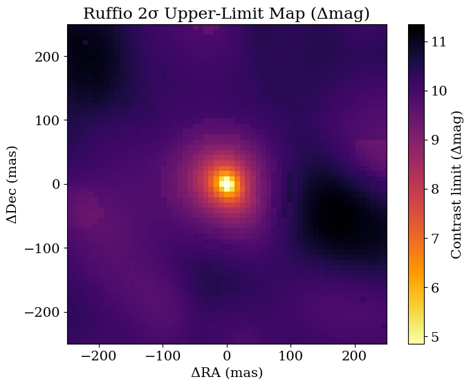
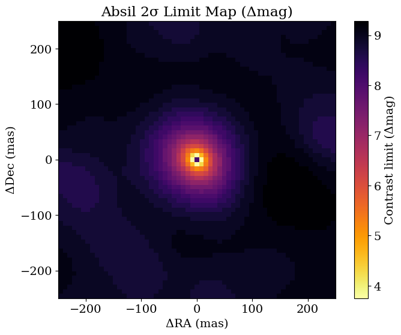
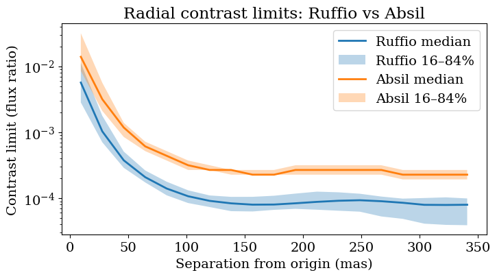

<!-- AUTO-GENERATED FROM /Users/benpope/code/drpangloss/notebooks/contrast_limits.ipynb by scripts/sync_tutorial_docs.py. -->
<!-- Edit the notebook, then re-run the sync script. -->

# Contrast limits with Ruffio method

Suppose you have a non-detection; or suppose you have a detection of a point source very accurately, and you can subtract that signal off the visibilities and you want to know if there is anything *else* in the data. How can you quantify what your detection limits would have been?

There are two methods widely in use in interferometry and this tutorial covers both of them:

- the [Ruffio method](https://ui.adsabs.harvard.edu/abs/2018AJ....156..196R/abstract), which is Bayesian. This calculates the posterior distribution for flux of a point source companion everywhere in a grid using the Laplace approximation, and uses this to put a posterior Nσ upper limit on any flux.
- the [Absil method](https://ui.adsabs.harvard.edu/abs/2011A%26A...535A..68A/abstract), which is frequentist, and relies on $\chi^2$ statistics to put a confidence interval on the data and report an upper limit.

In this tutorial we'll work through applying both methods to a nondetection.

First, let's import everything we need.

```python
import sys
from pathlib import Path

import jax.numpy as jnp
import numpy as onp
import jax.scipy as jsp
import matplotlib.pyplot as plt
import pyoifits as oifits

repo_root = Path.cwd()
if not (repo_root / "src").exists():
    repo_root = repo_root.parent
src_path = repo_root / "src"
if str(src_path) not in sys.path:
    sys.path.insert(0, str(src_path))

from drpangloss.models import OIData, BinaryModelCartesian
from drpangloss.grid_fit import (
    likelihood_grid,
    optimized_contrast_grid,
    laplace_contrast_uncertainty_grid,
    ruffio_upperlimit,
    absil_limits,
)
from drpangloss.plotting import (
    plot_contrast_limit_map,
    radial_limit_summary,
    plot_radial_limit_summary,
)
```

## Simulate Data

Now we will generate some synthetic data from pure noise, using a Fourier sampling similar to the JWST AMI mask.

```python
rng = onp.random.default_rng(7)

fname = "NuHor_F480M.oifits"
ddir = "../data/"
data = oifits.open(ddir + fname)
try:
    data.verify("silentfix")
except AttributeError:
    pass

oidata = OIData(data)

# Pure-noise injection amplitude (1.0 uses nominal OIData uncertainties).
noise_amp = 1.0

sim_data = {
    "u": oidata.u,
    "v": oidata.v,
    "wavel": oidata.wavel,
    "vis": jnp.ones_like(oidata.vis)
    + noise_amp * jnp.array(rng.normal(size=oidata.vis.shape)) * oidata.d_vis,
    "d_vis": oidata.d_vis,
    "phi": noise_amp * jnp.array(rng.normal(size=oidata.phi.shape)) * oidata.d_phi,
    "d_phi": oidata.d_phi,
    "i_cps1": oidata.i_cps1,
    "i_cps2": oidata.i_cps2,
    "i_cps3": oidata.i_cps3,
    "v2_flag": oidata.v2_flag,
    "cp_flag": oidata.cp_flag,
}

oidata_sim = OIData(sim_data)

print('Noise amplitude: {:.2g}, Vis std: {:.2g}, Phi std: {:.2g}'.format(noise_amp, float(jnp.std(sim_data["vis"] - 1.0)), float(jnp.std(sim_data["phi"]))))
```

```text
Noise amplitude: 1, Vis std: 0.00033, Phi std: 0.016
```

## Declare a search grid

Next we declare the grid over which we're going to search for companions, and we will use this to initialize the flux level in each grid pixel around which we are going to expand the posterior / come up with confidence intervals.

```python
samples = {
    "dra": jnp.linspace(-250.0, 250.0, 61),
    "ddec": jnp.linspace(-250.0, 250.0, 61),
    "flux": 10 ** jnp.linspace(-5.0, -1.5, 50),
}

ll_cube = likelihood_grid(oidata_sim, BinaryModelCartesian, samples)
opt_flux = optimized_contrast_grid(oidata_sim, BinaryModelCartesian, samples)
best_idx = jnp.argmax(ll_cube, axis=2)
```

## Ruffio Contrast Limits

The [Ruffio et al 2018](https://ui.adsabs.harvard.edu/abs/2018AJ....156..196R/abstract) method for contrast limits is Bayesian - you infer the Gaussian posterior on flux of a companion, and impose a prior that the flux is positive. Then you report a chosen percentile of this as the flux upper limit for a nondetection, *conditioned on this being the correct astrometry and there being a real source there*.

```python

sigma_flux = laplace_contrast_uncertainty_grid(
    best_idx, oidata_sim, BinaryModelCartesian, samples
)

# Ruffio method at 2σ equivalent percentile
perc = jnp.array([jsp.stats.norm.cdf(2.0)])
ruffio_flat = ruffio_upperlimit(opt_flux.flatten(), sigma_flux.flatten(), perc)
ruffio_map = ruffio_flat.reshape(*opt_flux.shape, perc.shape[0])[:, :, 0]

# 2D contrast-limit maps (Δmag): Ruffio and Absil

dra_axis = onp.array(samples["dra"])
ddec_axis = onp.array(samples["ddec"])
ruffio_np = onp.array(ruffio_map)

plot_contrast_limit_map(
    ruffio_np,
    dra_axis,
    ddec_axis,
    truth=None,
    unit_mode="delta_mag",
    title="Ruffio 2σ Upper-Limit Map (Δmag)",
    cmap="inferno",
);
```

```text
W0304 14:46:13.318260 3093216 cpp_gen_intrinsics.cc:74] Empty bitcode string provided for eigen. Optimizations relying on this IR will be disabled.
```



## Absil Contrast Limits

In [Absil et al 2011](https://ui.adsabs.harvard.edu/abs/2011A%26A...535A..68A/abstract), a frequentist p-value is used to infer an upper limit from data. This is done by a chi-squared hypothesis test, inferring what the highest contrast would be such that it would have been detected at n-σ.

```python

# Absil method at 2σ
absil_map = absil_limits(samples, oidata_sim, BinaryModelCartesian, sigma=2.0)

{
    "opt_flux_finite_frac": float(jnp.mean(jnp.isfinite(opt_flux))),
    "sigma_flux_finite_frac": float(jnp.mean(jnp.isfinite(sigma_flux))),
    "ruffio_finite_frac": float(jnp.mean(jnp.isfinite(ruffio_map))),
    "absil_finite_frac": float(jnp.mean(jnp.isfinite(absil_map))),
    "ruffio_median": float(jnp.nanmedian(ruffio_map)),
    "absil_median": float(jnp.nanmedian(absil_map)),
}
absil_np = onp.array(absil_map)


plot_contrast_limit_map(
    absil_np,
    dra_axis,
    ddec_axis,
    truth=None,
    unit_mode="delta_mag",
    title="Absil 2σ Limit Map (Δmag)",
    cmap="inferno",
);
```



## Contrast Curves
We can visualize these as contrast curves, and plot these on the same axis. They come out to be pretty similar but not quite identical.

```python
# Overplot Ruffio and Absil radial contrast curves on one axis
fig, ax = plt.subplots(figsize=(8, 4))

ruffio_radial_summary = radial_limit_summary(ruffio_map, dra_axis, ddec_axis)
absil_radial_summary = radial_limit_summary(absil_map, dra_axis, ddec_axis)

plot_radial_limit_summary(
    ruffio_radial_summary,
    unit_mode="flux_ratio",
    title="Radial contrast limits: Ruffio vs Absil",
    ax=ax,
)
ax.lines[-1].set_label("Ruffio median")
ax.collections[-1].set_label("Ruffio 16–84%")

plot_radial_limit_summary(
    absil_radial_summary,
    unit_mode="flux_ratio",
    title="Radial contrast limits: Ruffio vs Absil",
    ax=ax,
)
ax.lines[-1].set_label("Absil median")
ax.collections[-1].set_label("Absil 16–84%")

ax.set_xlabel("Separation from origin (mas)")
ax.legend(loc="best")
```

```text
<matplotlib.legend.Legend at 0x166d95690>
```


