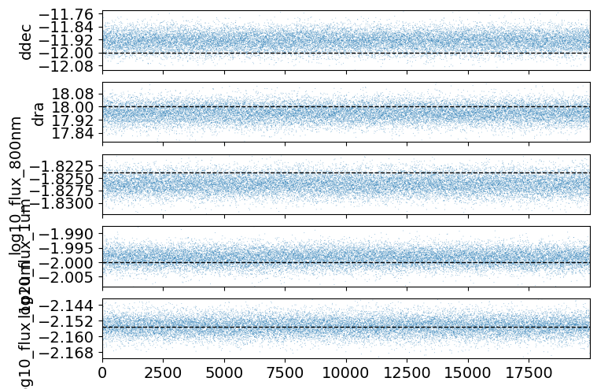
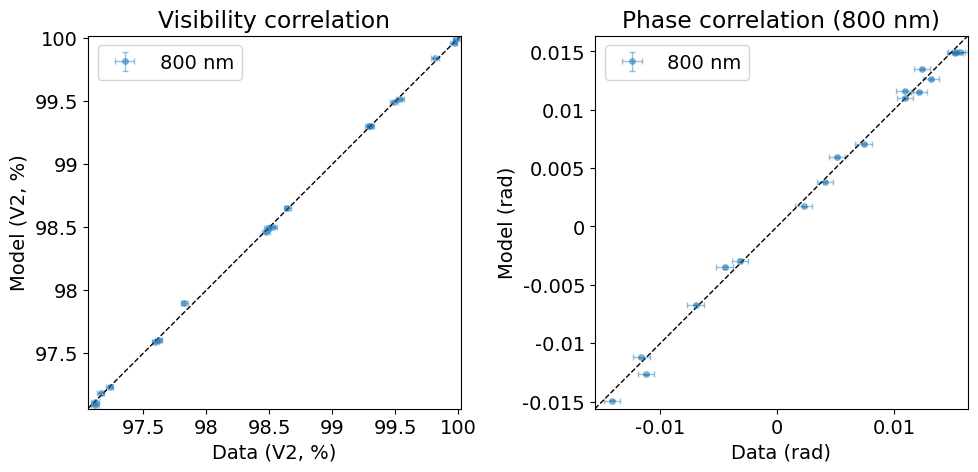
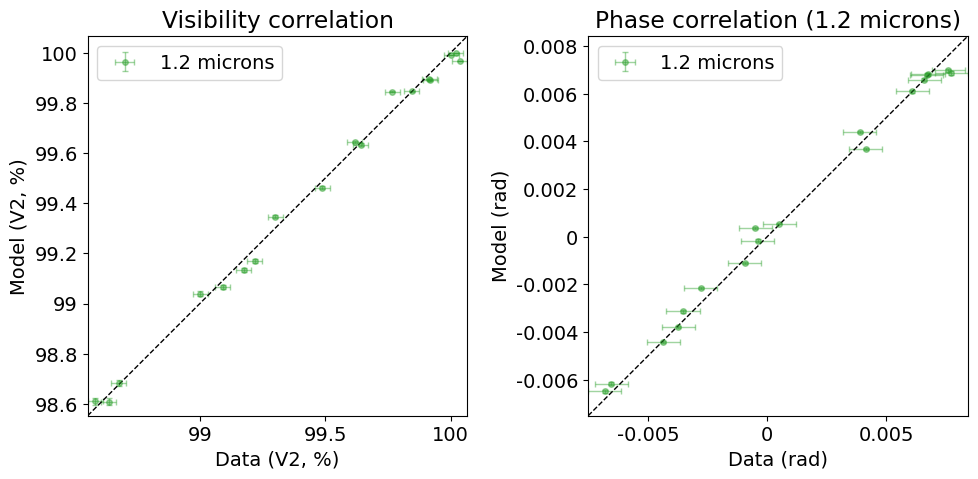
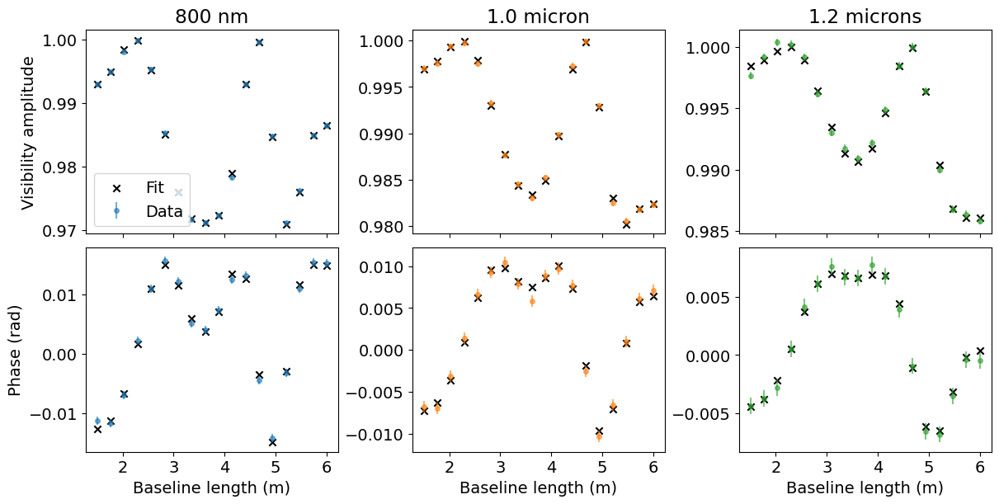

<!-- AUTO-GENERATED FROM notebooks/hierarchical_inference.ipynb by scripts/sync_tutorial_docs.py. -->
# Hierarchical binary inference across filters

We often have multiple datasets with different telescopes or wavelengths, and it is useful to be able to treat a shared scene geometry with different fluxes at different wavelengths, for example; this is the principle behind (say) [SPARCO](https://arxiv.org/abs/1403.3343), where objects in the scene are allowed to have different SEDs.

Here is a simple example where we fit a binary model to three interferometric observations simultaneously, taken at three different wavelengths. The binary position is shared between filters, while each filter has its own flux ratio.

Many of the ideas in this notebook are explored in greater detail [in the Zodiax docs](https://louisdesdoigts.github.io/zodiax/optimisation_tools/) - check them out!

```python
import sys
from pathlib import Path

import jax
import optimistix as optx

jax.config.update("jax_enable_x64", True)

import jax.numpy as jnp
import matplotlib.pyplot as plt
from jax.flatten_util import ravel_pytree

repo_root = Path.cwd()
if not (repo_root / "src").exists():
    repo_root = repo_root.parent
for path in (repo_root, repo_root / "src"):
    if str(path) not in sys.path:
        sys.path.insert(0, str(path))

from drpangloss.inference import (
    fisher_projection,
    gaussian_fisher,
    observed_information,
    regularized_inverse,
)
from drpangloss.models import (
    BinaryModelCartesian,
    joint_loglike,
    joint_prediction,
)
from examples.hierarchical_binary_workflow import (
    FILTER_LABELS,
    binary_model,
    observation_errors,
    simulate_observations,
)
```

## Simulate three observations

The three `OIData` objects have the same baseline sampling and uncertainties but wavelengths of 800 nm, 1.0 micron, and 1.2 microns.

```python
observations, truth = simulate_observations(seed=7)

{
    label: {
        "wavelength_m": float(observation.wavel[0]),
        "n_observables": int(observation.flatten_data()[0].size),
        "flux_ratio": float(10.0 ** truth["log10_flux"][index]),
    }
    for index, (label, observation) in enumerate(
        zip(FILTER_LABELS, observations)
    )
}
```

```text
W0919 17:44:53.064665  506698 cpp_gen_intrinsics.cc:74] Empty bitcode string provided for eigen. Optimizations relying on this IR will be disabled.
```

```text
{'800 nm': {'wavelength_m': 8e-07,
  'n_observables': 36,
  'flux_ratio': 0.014999999999999996},
 '1.0 micron': {'wavelength_m': 1e-06,
  'n_observables': 36,
  'flux_ratio': 0.010000000000000005},
 '1.2 microns': {'wavelength_m': 1.2e-06,
  'n_observables': 36,
  'flux_ratio': 0.007000000000000002}}
```

## Define the hierarchy

A hierarchical model is easily expressed by an ordinary JAX pytree. The astrometry is shared, while indexing the flux vector selects a parameter unique to each observation. This is the same model-building pattern used by Zodiax: parameters remain separate from the objects that describe each observation.

```python
params = {
    "dra": jnp.array(15.0),
    "ddec": jnp.array(-9.0),
    "log10_flux": jnp.log10(jnp.array([0.012, 0.012, 0.012])),
}


def model_fn(values, observation_index):
    return BinaryModelCartesian(
        values["dra"],
        values["ddec"],
        10.0 ** values["log10_flux"][observation_index],
    )


initial_loglike = joint_loglike(params, observations, model_fn)
truth_loglike = joint_loglike(truth, observations, model_fn)
{
    "initial_loglike": float(initial_loglike),
    "truth_loglike": float(truth_loglike),
}
```

```text
{'initial_loglike': -6385.33425087397, 'truth_loglike': -48.91251621611459}
```

## Preconditioning before Inference

The Fisher Information Matrix tells us the expected information in the data, providing both a limit to the best possible covariance we can obtain from the data (the Cramér-Rao lower bound) and a way of normalising parameters, which might have very different scales and correlations. It is often best to do this normalization before Bayesian inference, in order to precondition the model for fast convergence.

```python
prediction_fn = lambda values: joint_prediction(
    values, observations, binary_model
)
errors = observation_errors(observations)
initial_fisher, unravel = gaussian_fisher(
    prediction_fn, params, errors, ridge=1e-8
)
projection = fisher_projection(initial_fisher, eps=1e-10)

{
    "fisher_shape": initial_fisher.shape,
    "whitened_metric": projection.T @ initial_fisher @ projection,
}
```

```text
{'fisher_shape': (5, 5),
 'whitened_metric': Array([[ 1.00000000e+00, -1.27301457e-14,  2.65879295e-15,
         -8.28795953e-15, -1.63882087e-15],
        [-1.27803055e-14,  1.00000000e+00, -1.38036846e-16,
          2.59037282e-16,  1.90507011e-16],
        [ 2.57401550e-15, -2.15819231e-16,  1.00000000e+00,
         -6.67937215e-17, -1.67082727e-16],
        [-8.30188663e-15,  2.39350635e-16, -6.68363146e-17,
          1.00000000e+00, -8.98250567e-17],
        [-1.65031501e-15,  1.92294384e-16, -1.67144588e-16,
         -8.98142407e-17,  1.00000000e+00]], dtype=float64)}
```

## Optimization

We first fit the model using optimization from a decent starting point:

```python
initial_vector, unravel = ravel_pytree(params)


def project(latent):
    # Map latent optimization coordinates back to model parameters.
    return unravel(initial_vector + projection @ latent)


def latent_objective(latent, args):
    # Optimize the negative joint log-likelihood in latent coordinates.
    del args
    return -joint_loglike(project(latent), observations, binary_model)


solver = optx.BestSoFarMinimiser(optx.BFGS(rtol=1e-8, atol=1e-8))
solution = optx.minimise(
    latent_objective,
    solver,
    jnp.zeros_like(initial_vector),
    max_steps=256,
    throw=False,
)
recovered = project(solution.value)

recovered_flux = 10.0 ** recovered["log10_flux"]
truth_flux = 10.0 ** truth["log10_flux"]
{
    "initial_reduced_chi2": float(
        jnp.sum(
            (
                (
                    jnp.concatenate(
                        [
                            observation.flatten_data()[0]
                            for observation in observations
                        ]
                    )
                    - prediction_fn(params)
                )
                / errors
            )
            ** 2
        )
        / (errors.size - initial_vector.size)
    ),
    "final_reduced_chi2": float(
        jnp.sum(
            (
                (
                    jnp.concatenate(
                        [
                            observation.flatten_data()[0]
                            for observation in observations
                        ]
                    )
                    - prediction_fn(recovered)
                )
                / errors
            )
            ** 2
        )
        / (errors.size - initial_vector.size)
    ),
    "truth_dra_mas": float(truth["dra"]),
    "recovered_dra_mas": float(recovered["dra"]),
    "truth_ddec_mas": float(truth["ddec"]),
    "recovered_ddec_mas": float(recovered["ddec"]),
    "truth_fluxes": truth_flux,
    "recovered_fluxes": recovered_flux,
}
```

```text
{'initial_reduced_chi2': 123.9870728325043,
 'final_reduced_chi2': 0.8943819615350423,
 'truth_dra_mas': 18.0,
 'recovered_dra_mas': 17.96212282578262,
 'truth_ddec_mas': -12.0,
 'recovered_ddec_mas': -11.928193565383811,
 'truth_fluxes': Array([0.015, 0.01 , 0.007], dtype=float64),
 'recovered_fluxes': Array([0.01491984, 0.01003515, 0.00700039], dtype=float64)}
```

```python
recovered_vector, recovered_unravel = ravel_pytree(recovered)


def flat_objective(values):
    # Evaluate the negative log-likelihood for flat parameter vectors.
    return -joint_loglike(
        recovered_unravel(values), observations, binary_model
    )


expected_fisher, _ = gaussian_fisher(prediction_fn, recovered, errors)
observed_info = observed_information(flat_objective, recovered_vector)
laplace_covariance = regularized_inverse(observed_info, ridge=1e-8)

parameter_names = [
    "ddec (mas)",
    "dra (mas)",
    "log10 flux: 800 nm",
    "log10 flux: 1.0 micron",
    "log10 flux: 1.2 microns",
]
laplace_sigma = jnp.sqrt(jnp.diag(laplace_covariance))
{
    name: {"estimate": float(value), "laplace_sigma": float(sigma)}
    for name, value, sigma in zip(
        parameter_names, recovered_vector, laplace_sigma
    )
}
```

```text
{'ddec (mas)': {'estimate': -11.928193565383811,
  'laplace_sigma': 0.048961508424356745},
 'dra (mas)': {'estimate': 17.96212282578262,
  'laplace_sigma': 0.04878174841724983},
 'log10 flux: 800 nm': {'estimate': -1.8262356970862887,
  'laplace_sigma': 0.001677751652555576},
 'log10 flux: 1.0 micron': {'estimate': -1.9984762187934384,
  'laplace_sigma': 0.002589982668792857},
 'log10 flux: 1.2 microns': {'estimate': -2.154877810613793,
  'laplace_sigma': 0.004064131977928648}}
```

## Corner plot of shared and per-filter parameters

Let's visualize the recovered parameters and compare them to the truth values from which they are simulated:

```python
import numpy as onp
import pandas as pd

from drpangloss.plotting import (
    plot_chainconsumer_diagnostics,
    plot_data_model_correlation,
    posterior_predictive_summary,
)

parameter_columns = [
    "ddec",
    "dra",
    "log10_flux_800nm",
    "log10_flux_1um",
    "log10_flux_1p2um",
]

flat_recovered, unravel_recovered = ravel_pytree(recovered)
flat_truth, _ = ravel_pytree(truth)

# Gaussian samples from the local Laplace covariance around the fitted solution.
n_samples = 20000
cholesky = jnp.linalg.cholesky(laplace_covariance)
standard_normal = jax.random.normal(
    jax.random.key(11), (n_samples, flat_recovered.size)
)
latent_samples = flat_recovered[None, :] + standard_normal @ cholesky.T

samples_df = pd.DataFrame(
    onp.asarray(latent_samples), columns=parameter_columns
)
truth_dict = dict(zip(parameter_columns, onp.asarray(flat_truth)))

plot_chainconsumer_diagnostics(
    {"Laplace approximation": samples_df},
    columns=parameter_columns,
    truth=truth_dict,
    colors=["#1f77b4"],
);
```




## Posterior predictive correlation per filter

As always, we check the fit against the data directly rather than trusting the corner plot alone. Each filter has its own flux, so we build one data-vs-model correlation plot per observation using the shared astrometry samples paired with that filter's flux samples.

```python
# Subsample the Laplace draws for the (slower, per-sample) posterior predictive check.
predictive_samples = jax.vmap(unravel_recovered)(latent_samples[:500])

for index, (label, observation) in enumerate(zip(FILTER_LABELS, observations)):
    predicted = posterior_predictive_summary(
        onp.asarray(predictive_samples["dra"]),
        onp.asarray(predictive_samples["ddec"]),
        onp.asarray(10.0 ** predictive_samples["log10_flux"][:, index]),
        observation,
        BinaryModelCartesian,
    )
    plot_data_model_correlation(
        observation,
        {label: predicted},
        colors=[f"C{index}"],
        phase_title=f"Phase correlation ({label})",
    )
    plt.show()
```






## Visibility and phase versus baseline

Finally, we look at visibility amplitude and phase directly as a function of baseline length, one column per filter. Because the three observations share the same array geometry, the baseline lengths are identical; only the flux, and therefore the fitted amplitude and phase, differ between filters.

```python
fig, axes = plt.subplots(
    2, 3, figsize=(12, 6), sharex=True, constrained_layout=True
)

for index, (label, observation) in enumerate(zip(FILTER_LABELS, observations)):
    baseline = jnp.sqrt(observation.u**2 + observation.v**2)
    cvis_fit = binary_model(recovered, index).model(
        observation.u, observation.v, observation.wavel
    )
    vis_fit = observation.to_vis(cvis_fit)
    phi_fit = observation.to_phases(cvis_fit)

    ax_vis, ax_phi = axes[0, index], axes[1, index]
    ax_vis.errorbar(
        baseline,
        observation.vis,
        yerr=observation.d_vis,
        fmt="o",
        markersize=4,
        alpha=0.6,
        color=f"C{index}",
        label="Data",
    )
    ax_vis.scatter(baseline, vis_fit, marker="x", color="k", label="Fit")
    ax_vis.set_title(label)

    ax_phi.errorbar(
        baseline,
        observation.phi,
        yerr=observation.d_phi,
        fmt="o",
        markersize=4,
        alpha=0.6,
        color=f"C{index}",
    )
    ax_phi.scatter(baseline, phi_fit, marker="x", color="k")
    ax_phi.set_xlabel("Baseline length (m)")

axes[0, 0].set_ylabel("Visibility amplitude")
axes[1, 0].set_ylabel("Phase (rad)")
axes[0, 0].legend(loc="best")
plt.show()
```


