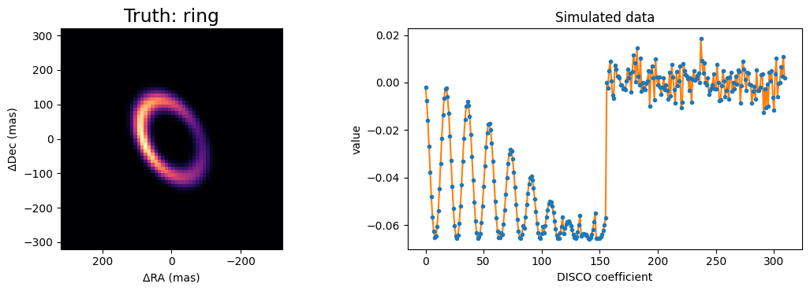

<!-- AUTO-GENERATED FROM notebooks/imaging_ami.ipynb by scripts/sync_tutorial_docs.py. -->
# Imaging with AMI, part 1: simulating DISCO data from an image

Before reconstructing images from aperture-masking data, we need to be sure we can *simulate* such data from a known image. This tutorial does that for JWST/NIRISS AMI data as processed by AMIGO, whose products are "mixed DISCO" coefficients: linear combinations of the log-amplitudes and phases of the complex visibilities, with independent errors.

Real DISCO products are large, so we use `virgil.coverage.ami_grid_record`, a small record built the same way, computed on the fly. Its complex visibilities live on a fine uv grid, rotated on the sky as AMI data are by the parallactic angle, and only the cells inside the mask's splodges carry information, weighted by the mask's transfer function. That information is compressed, as in AMIGO, into orthonormal modes that are blind to the source's flux and position, keeping 99% of the precision. Everything below is simulated.

```python
import sys
import time
from pathlib import Path

import equinox as eqx
import jax
import jax.numpy as jnp
import matplotlib.pyplot as plt

repo_root = Path.cwd()
if not (repo_root / "src").exists():
    repo_root = repo_root.parent
if str(repo_root / "src") not in sys.path:
    sys.path.insert(0, str(repo_root / "src"))

from virgil import pixel_offsets
from virgil.coverage import ami_grid_record
from virgil.models import BinaryModelCartesian, Image, PointSource, System
from virgil.oidata import OIData
from virgil.plotting import plot_model
from virgil.scenes import ring, spiral

template = OIData(ami_grid_record(wavelength_m=4.8e-6, rotation_deg=-6.9))
longest = float(jnp.hypot(template.u, template.v).max())
fringe_mas = 206265e3 * float(template.wavel) / longest
print(f"{1e6 * float(template.wavel):.2f} um, {template.u.size} uv points")
print(f"longest baseline {longest:.1f} m, finest fringes {fringe_mas:.0f} mas")
print(f"uv lattice rotated by {template.uv_grid.rotation_deg:.1f} deg")

fig, ax = plt.subplots(figsize=(4, 4))
ax.plot(template.u, template.v, ".")
ax.set(xlabel="u (m)", ylabel="v (m)", title="uv points", aspect="equal")
plt.show()
```

```text
4.80 um, 412 uv points
longest baseline 5.9 m, finest fringes 167 mas
uv lattice rotated by -6.9 deg
```


The samples are a lattice rotated by the parallactic angle. virgil finds the lattice when the data are loaded (`template.uv_grid`); we will use it at the end.

## The truth scene

At 4.8 µm the finest fringes have a period of about 150 mas, so structure several hundred milliarcseconds across spans several resolution elements, and pixels of 20 mas are fine enough. Our truth is a dusty spiral in the style of the "pinwheel" nebulae of WR 104 and WR 137, around an unresolved star.

`virgil.scenes.spiral` returns a unit-sum image in the virgil orientation (East left, North up). `Image.from_brightness` turns it into a model component whose pixels are the free parameters of an imaging fit. Like every component, it carries a `flux` relative to the others in a `System`: here the dust has 5% of the star's flux.

```python
npix, pixel_scale = 64, 20.0  # 1280 mas field of view
truth = spiral(
    npix,
    pixel_scale,
    step_mas=250.0,
    width_mas=40.0,
    turns=2.0,
    fade_mas=500.0,
)
scene = System(
    star=PointSource(),
    dust=Image.from_brightness(truth, pixel_scale, flux=0.05),
)

plot_model(
    scene.dust,
    fov_mas=npix * pixel_scale,
    npix=npix,
    title="Truth: dust spiral",
)
plt.show()
```


## Simulating noisy data

`OIData.with_model` evaluates a model at the uv points of an existing data object, adds Gaussian noise with that object's error bars, and keeps the DISCO operators. The key makes the noise reproducible.

```python
simulated = template.with_model(scene, key=jax.random.PRNGKey(0))
data, errors = simulated.flatten_data()
prediction = simulated.model(scene)

fig, ax = plt.subplots(figsize=(9, 3.5))
ax.plot(prediction, "-", color="C1", label="noiseless model")
ax.errorbar(
    range(data.size), data, errors, fmt=".", color="C0", label="simulated data"
)
ax.set(xlabel="DISCO coefficient", ylabel="value")
ax.legend()
plt.show()

chi2 = jnp.sum(((data - prediction) / errors) ** 2)
print(f"chi^2 of the truth: {chi2:.0f} for {data.size} coefficients")
```


```text
chi^2 of the truth: 595 for 588 coefficients
```

The first coefficients are the log-amplitudes and the rest are shift-invariant phase combinations. The data scatter around the model within their error bars, and the chi-squared of the truth is comparable to the number of coefficients, as it should be.

## Check: one bright pixel is a binary

A good test of a pixelised model is a case with a known answer. An `Image` with all of its flux in a single pixel is a point source at that pixel's offset, so inside a `System` with a star it must agree with the analytic `BinaryModelCartesian`. Row 20 is North of the image centre and column 40 is West of it, so `pixel_offsets` gives the offset with East and North positive.

```python
row, col = 20, 40
offsets = pixel_offsets(npix, pixel_scale)
one_pixel = jnp.full((npix, npix), -jnp.inf).at[row, col].set(0.0)

pixels = System(
    star=PointSource(), companion=Image(one_pixel, pixel_scale, flux=0.05)
)
binary = BinaryModelCartesian(dra=offsets[col], ddec=offsets[row], flux=0.05)

difference = jnp.abs(template.model(pixels) - template.model(binary))
print(
    f"companion at dRA = {offsets[col]:.0f} mas, dDec = {offsets[row]:.0f} mas"
)
print(f"largest difference in the DISCO observables: {difference.max():.1e}")
print(f"largest observable: {jnp.abs(template.model(binary)).max():.1e}")
```

```text
companion at dRA = -170 mas, dDec = 230 mas
largest difference in the DISCO observables: 1.1e-07
largest observable: 9.0e-02
```

The two agree to float32 rounding, so the image and the analytic model are interchangeable in the likelihood.

## Pixels that follow the detector

The visibilities of an `Image` are an exact sum over its pixels, whatever the uv sampling. When the samples lie on a lattice, and the image's pixel grid is rotated to match it (`rotation_deg`), the sum separates into two small matrix products, the matrix Fourier transform of Soummer et al. (2007). That is much faster and gives the same answer. For AMI this means pixels aligned with the detector rather than with North; `render` and `plot_model` still show the image North up.

```python
rotation = template.uv_grid.rotation_deg
detector_dust = Image.from_model(
    scene.dust, npix, pixel_scale, flux=0.05, rotation_deg=rotation
)
detector_scene = System(star=PointSource(), dust=detector_dust)
per_point = eqx.tree_at(
    lambda d: d.uv_grid, template, None, is_leaf=lambda x: x is None
)

evaluate = eqx.filter_jit(lambda data_object, model: data_object.model(model))
for name, data_object in [("lattice (MFT)", template), ("per point", per_point)]:
    evaluate(data_object, detector_scene).block_until_ready()
    start = time.perf_counter()
    for _ in range(100):
        evaluate(data_object, detector_scene).block_until_ready()
    print(f"{name}: {10 * (time.perf_counter() - start):.2f} ms per evaluation")

difference = jnp.abs(template.model(detector_scene) - per_point.model(detector_scene))
print(f"largest difference: {difference.max():.1e}")
```

```text
lattice (MFT): 0.11 ms per evaluation
per point: 0.22 ms per evaluation
```

```text
largest difference: 8.6e-08
```

## Another scene: a lopsided ring

`virgil.scenes` also has an inclined ring with one brighter side, and a Gaussian blob for clumps or companions. Position angles are measured from North towards East, so the brightest part of this ring, at position angle 90 degrees, lies to the left of the image.

```python
ring_image = ring(
    npix,
    pixel_scale,
    radius_mas=240.0,
    width_mas=36.0,
    inc_deg=50.0,
    pa_deg=30.0,
    asymmetry=0.6,
    asymmetry_pa_deg=90.0,
)
ring_scene = System(
    star=PointSource(),
    dust=Image.from_brightness(ring_image, pixel_scale, flux=0.05),
)
ring_data = template.with_model(ring_scene, key=jax.random.PRNGKey(1))

fig, axes = plt.subplots(1, 2, figsize=(11, 3.8))
plot_model(
    ring_scene.dust,
    fov_mas=npix * pixel_scale,
    npix=npix,
    ax=axes[0],
    title="Truth: ring",
)
d, e = ring_data.flatten_data()
axes[1].plot(ring_data.model(ring_scene), "-", color="C1")
axes[1].errorbar(range(d.size), d, e, fmt=".", color="C0")
axes[1].set(xlabel="DISCO coefficient", ylabel="value", title="Simulated data")
plt.tight_layout()
plt.show()
```



## Next steps

We now have simulated data and a truth to compare against. The next parts reconstruct the image from data like these, starting from a parametric fit and moving to free pixels with regularisation.
