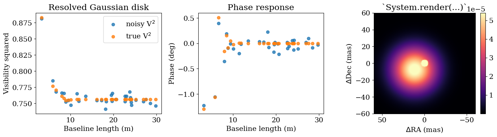
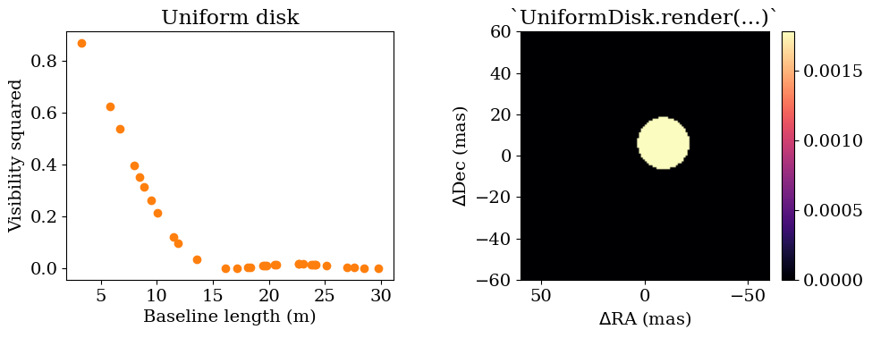
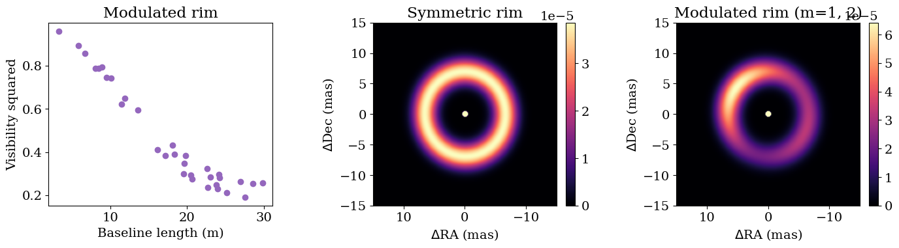
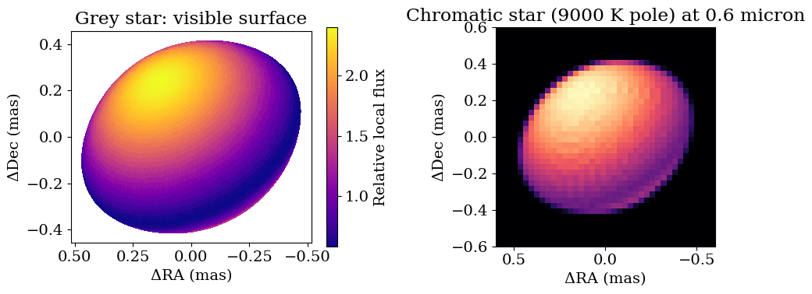

<!-- AUTO-GENERATED FROM notebooks/source_models.ipynb by scripts/sync_tutorial_docs.py. -->
# Extended source models

This tutorial mirrors the binary-model walkthrough style, but focuses on the non-binary source models in `drpangloss`: `GaussianDiskModel` (a star plus a Gaussian disk), the `UniformDisk` and `ModulatedGaussianRim` building blocks, and `GravityDarkenedStar` (a rapidly rotating star). Spotted stars from harmonix, wrapped in `HarmonixModel`, have [their own tutorial](harmonix.md).

We'll build synthetic interferometric observables from a resolved Gaussian disk, pass them through `OIData`, then do the same for a uniform disk and an azimuthally modulated rim, and finally draw a gravity-darkened rapid rotator. See the composition tutorial for how to combine these building blocks into more complex scenes.

```python
import sys
from pathlib import Path

import numpy as np
import jax.numpy as jnp
import matplotlib.pyplot as plt

from drpangloss.plotting import set_style

repo_root = Path.cwd()
if not (repo_root / "src").exists():
    repo_root = repo_root.parent
src_path = repo_root / "src"
if str(src_path) not in sys.path:
    sys.path.insert(0, str(src_path))

from drpangloss.models import (
    GaussianDiskModel,
    ModulatedGaussianRim,
    PointSource,
    System,
    UniformDisk,
)
from drpangloss.oidata import OIData

set_style()  # the figure style used throughout the docs
```

## Simulate resolved-disk observables

As with the binary examples, we start from a simple baseline geometry, instantiate a source model, and evaluate complex visibilities on those baselines.

```python
rng = np.random.default_rng(7)
n_bl = 32
u = jnp.array(rng.uniform(-24.0, 24.0, size=n_bl))
v = jnp.array(rng.uniform(-24.0, 24.0, size=n_bl))
wavel = jnp.full((n_bl,), 1.65e-6)

truth = {"sigma": 18.0, "flux": 0.15, "dra": 12.0, "ddec": -7.5}
disk = GaussianDiskModel(**truth)
cvis_true = disk.model(u, v, wavel)

vis_true = jnp.abs(cvis_true) ** 2
phi_true = jnp.rad2deg(jnp.angle(cvis_true))

vis_scale = jnp.maximum(jnp.median(vis_true), 1e-6)
phi_scale = jnp.maximum(jnp.median(jnp.abs(phi_true)), 5.0)
d_vis = 0.01 * vis_scale * jnp.ones_like(vis_true)
d_phi = 0.02 * phi_scale * jnp.ones_like(phi_true)

vis_obs = vis_true + d_vis * jnp.array(rng.normal(size=vis_true.shape))
phi_obs = phi_true + d_phi * jnp.array(rng.normal(size=phi_true.shape))

data = OIData({
    "u": u,
    "v": v,
    "wavel": wavel,
    "vis": vis_obs,
    "d_vis": d_vis,
    "phi": phi_obs,
    "d_phi": d_phi,
    "i_cps1": None,
    "i_cps2": None,
    "i_cps3": None,
    "v2_flag": True,
    "cp_flag": False,
})

{
    "n_baselines": int(n_bl),
    "sigma_mas": truth["sigma"],
    "flux": truth["flux"],
    "centroid_mas": (truth["dra"], truth["ddec"]),
    "vis_range": (float(jnp.min(vis_true)), float(jnp.max(vis_true))),
}
```

```text
{'n_baselines': 32,
 'sigma_mas': 18.0,
 'flux': 0.15,
 'centroid_mas': (12.0, -7.5),
 'vis_range': (0.7543692588806152, 0.8830579519271851)}
```

## Use `OIData` to flatten observables

`OIData.model(...)` evaluates the source model, converts complex visibilities to the configured observables, and flattens the result into a vector that can be compared directly to the measured data.

```python
model_vec = data.model(disk)
data_vec, err_vec = data.flatten_data()

{
    "model_len": int(model_vec.shape[0]),
    "data_len": int(data_vec.shape[0]),
    "error_len": int(err_vec.shape[0]),
    "vector_alignment": bool(
        model_vec.shape == data_vec.shape == err_vec.shape
    ),
}
```

```text
{'model_len': 64, 'data_len': 64, 'error_len': 64, 'vector_alignment': True}
```

## Visualize the Gaussian disk in Fourier and image space

A resolved Gaussian disk has visibility amplitudes that fall smoothly with baseline length. The new `render(...)` method gives a matching image-plane representation for plotting and sanity checks.

```python
baseline = np.sqrt(np.asarray(u) ** 2 + np.asarray(v) ** 2)
image = np.asarray(disk.render(npix=128, fov_mas=120.0))

fig, axes = plt.subplots(1, 3, figsize=(14, 4))

axes[0].scatter(baseline, np.asarray(vis_obs), alpha=0.8, label="noisy V$^2$")
axes[0].scatter(baseline, np.asarray(vis_true), alpha=0.8, label="true V$^2$")
axes[0].set_xlabel("Baseline length (m)")
axes[0].set_ylabel("Visibility squared")
axes[0].set_title("Resolved Gaussian disk")
axes[0].legend(loc="best")

axes[1].scatter(baseline, np.asarray(phi_obs), alpha=0.8, label="noisy phase")
axes[1].scatter(baseline, np.asarray(phi_true), alpha=0.8, label="true phase")
axes[1].set_xlabel("Baseline length (m)")
axes[1].set_ylabel("Phase (deg)")
axes[1].set_title("Phase response")

im = axes[2].imshow(
    image,
    extent=[60.0, -60.0, -60.0, 60.0],
    cmap="magma",
    vmax=np.quantile(image, 0.99),  # saturate the unresolved star
)
axes[2].set_xlabel(r"$\Delta$RA (mas)")
axes[2].set_ylabel(r"$\Delta$Dec (mas)")
axes[2].set_title("`GaussianDiskModel.render(...)`")
fig.colorbar(im, ax=axes[2], fraction=0.046, pad=0.04)

plt.tight_layout()
plt.show()
```



## Spotted stars with harmonix

`HarmonixModel` wraps a star from [harmonix](https://github.com/shashankdholakia/harmonix), which computes the visibilities of a spherical-harmonic surface map analytically, so that it simulates, draws and fits like any other drpangloss model. See [Spotted stars with harmonix](harmonix.md) for a worked example.

## Simulate a uniform disk

`UniformDisk` represents a resolved tophat (uniform-brightness) disk. Like every building block it is a pure shape normalized to unit flux; put it in a `System` with a `PointSource` if you also want an unresolved star. Its visibility amplitude follows the classic Airy pattern `2*J1(x)/x`.

```python
udisk = UniformDisk(diam=25.0, dra=-9.0, ddec=6.0)
cvis_udisk = udisk.model(u, v, wavel)

vis_udisk = jnp.abs(cvis_udisk) ** 2
phi_udisk = jnp.rad2deg(jnp.angle(cvis_udisk))
model_vec_udisk = data.model(udisk)

{
    "diam_mas": float(udisk.diam),
    "centroid_mas": (float(udisk.dra), float(udisk.ddec)),
    "vis_range": (float(jnp.min(vis_udisk)), float(jnp.max(vis_udisk))),
    "model_len": int(model_vec_udisk.shape[0]),
}
```

```text
{'diam_mas': 25.0,
 'centroid_mas': (-9.0, 6.0),
 'vis_range': (0.0001409070537192747, 0.8681560754776001),
 'model_len': 64}
```

## Visualize the uniform disk in Fourier and image space

Visibility squared falls off with Airy-like nulls as baseline length grows; `render(...)` gives the matching tophat image.

```python
image_udisk = np.asarray(udisk.render(npix=128, fov_mas=120.0))

fig, axes = plt.subplots(1, 2, figsize=(10, 4))

axes[0].scatter(baseline, np.asarray(vis_udisk), color="tab:orange")
axes[0].set_xlabel("Baseline length (m)")
axes[0].set_ylabel("Visibility squared")
axes[0].set_title("Uniform disk")

im = axes[1].imshow(
    image_udisk,
    extent=[60.0, -60.0, -60.0, 60.0],
    cmap="magma",
)
axes[1].set_xlabel(r"$\Delta$RA (mas)")
axes[1].set_ylabel(r"$\Delta$Dec (mas)")
axes[1].set_title("`UniformDisk.render(...)`")
fig.colorbar(im, ax=axes[1], fraction=0.046, pad=0.04)

plt.tight_layout()
plt.show()
```



## Simulate an azimuthally modulated rim

`ModulatedGaussianRim` is an inclined, Gaussian-blurred ring, optionally modulated azimuthally with a sum of cosine terms (`az_amps`/`az_pas`). Adding a `PointSource` puts an unresolved star at the centre; the rim's `flux` is then its flux relative to the star. We compare a symmetric rim against one with first- and second-order modulations.

```python
rim_geometry = dict(diam=14.15, fwhm=3.233, inc=19.0, pa=6.0, flux=0.67504187604)
rim = ModulatedGaussianRim(
    **rim_geometry,
    az_amps=jnp.array([0.43011627, 0.2745906]),
    az_pas=jnp.array([35.537678 + 6.0, 50.245735 + 6.0]),
)
rim_symmetric = System(star=PointSource(), rim=ModulatedGaussianRim(**rim_geometry))
rim_modulated = System(star=PointSource(), rim=rim)

cvis_rim = rim_modulated.model(u, v, wavel)
vis_rim = jnp.abs(cvis_rim) ** 2
phi_rim = jnp.rad2deg(jnp.angle(cvis_rim))
model_vec_rim = data.model(rim_modulated)

{
    "diam_mas": float(rim.diam),
    "rim_to_star_flux": float(rim.flux),
    "az_amps": np.asarray(rim.az_amps).tolist(),
    "az_pas_deg": np.asarray(rim.az_pas).tolist(),
    "model_len": int(model_vec_rim.shape[0]),
}
```

```text
{'diam_mas': 14.149999618530273,
 'rim_to_star_flux': 0.6750418543815613,
 'az_amps': [0.4301162660121918, 0.2745906114578247],
 'az_pas_deg': [41.53767776489258, 56.24573516845703],
 'model_len': 64}
```

## Visualize the rim: azimuthal modulation and Fourier response

Rendering both variants side by side shows how `az_amps`/`az_pas` breaks the ring's azimuthal symmetry; the visibility-squared panel shows the modulated rim's (`flux`-mixed) Fourier response. The parameters are chosen here so the modulated rim model and its image
match the final geometric model shown for the post-AGB IRAS 08544-4431 in [Hillen et al. 2016](http://dx.doi.org/10.1051/0004-6361/201628125).

```python
image_rim_symmetric = np.asarray(rim_symmetric.render(npix=256, fov_mas=30.0))
image_rim_modulated = np.asarray(rim_modulated.render(npix=256, fov_mas=30.0))

fig, axes = plt.subplots(1, 3, figsize=(14, 4))

axes[0].scatter(baseline, np.asarray(vis_rim), color="tab:purple")
axes[0].set_xlabel("Baseline length (m)")
axes[0].set_ylabel("Visibility squared")
axes[0].set_title("Modulated rim")

im1 = axes[1].imshow(
    image_rim_symmetric,
    extent=[15.0, -15.0, -15.0, 15.0],
    cmap="magma",
    vmax=np.quantile(image_rim_symmetric, 0.999),  # saturate the unresolved star
)
axes[1].set_xlabel(r"$\Delta$RA (mas)")
axes[1].set_ylabel(r"$\Delta$Dec (mas)")
axes[1].set_title("Symmetric rim")
fig.colorbar(im1, ax=axes[1], fraction=0.046, pad=0.04)

im2 = axes[2].imshow(
    image_rim_modulated,
    extent=[15.0, -15.0, -15.0, 15.0],
    cmap="magma",
    vmax=np.quantile(image_rim_modulated, 0.999),
)
axes[2].set_xlabel(r"$\Delta$RA (mas)")
axes[2].set_ylabel(r"$\Delta$Dec (mas)")
axes[2].set_title("Modulated rim (m=1, 2)")
fig.colorbar(im2, ax=axes[2], fraction=0.046, pad=0.04)

plt.tight_layout()
plt.show()
```



## A rapidly rotating star: `GravityDarkenedStar`

`GravityDarkenedStar` models a star spinning close to break-up, using the Roche shape and gravity darkening of [Espinosa Lara & Rieutord (2011)](https://doi.org/10.1051/0004-6361/201117252), which needs no free gravity-darkening exponent. The model is Shashank Dholakia's port of ELR11 into JAX (from his `jax-interferometry` code), brought into `drpangloss` with his `ELR_Model` as its grey mode. Its parameters are the equatorial angular diameter `diam_eq` in mas, the rotation rate `omega` as a fraction of the critical rate (0 is a sphere), the inclination `inc` in degrees (0 is pole-on, 90 equator-on), and `pa`, the position angle of the visible rotation pole, North through East. The mesh resolution is set by `n_lat`.

By default the star is grey: its brightness pattern is the same at every wavelength. Passing `t_pole`, the pole's effective temperature in kelvin, switches on a chromatic mode in which each patch of the surface radiates as a black body, so the contrast between the hot pole and the cool equator grows towards short wavelengths; `wavel0` is the wavelength at which `render` draws it. Like the other components it can be placed in a `System`, for example with a companion. See the [MWE notebook](gravity_darkened_star.md) for a fit to simulated multi-channel VLTI data.

```python
from drpangloss.models import GravityDarkenedStar

star = GravityDarkenedStar(1.0, omega=0.9, inc=50.0, pa=30.0, n_lat=64)
hot_star = GravityDarkenedStar(
    1.0, omega=0.9, inc=50.0, pa=30.0, n_lat=64, t_pole=9000.0, wavel0=0.6e-6
)
cvis_star = star.model(u, v, wavel)

{
    "diam_eq_mas": float(star.diam_eq),
    "omega": float(star.omega),
    "n_baselines": int(cvis_star.shape[0]),
    "vis_range": (
        float(jnp.min(jnp.abs(cvis_star) ** 2)),
        float(jnp.max(jnp.abs(cvis_star) ** 2)),
    ),
}
```

```text
{'diam_eq_mas': 1.0,
 'omega': 0.8999999761581421,
 'n_baselines': 32,
 'vis_range': (0.985670268535614, 0.9998691082000732)}
```

The grey star's visible surface, coloured by local flux, shows the bright pole towards the upper left (with East to the left and North up, the pole at a position angle of 30 degrees) and the darkened equator. The chromatic star at 0.6 micron, drawn through `render`, is the same shape with the equator much dimmer than the pole.

```python
from drpangloss.plotting import plot_model

fig, axes = plt.subplots(1, 2, figsize=(10, 4))

star.plot_surface(ax=axes[0])
axes[0].set_title("Grey star: visible surface")

plot_model(
    hot_star,
    fov_mas=1.2,
    npix=40,
    ax=axes[1],
    title="Chromatic star (9000 K pole) at 0.6 micron",
)

plt.tight_layout()
plt.show()
```


